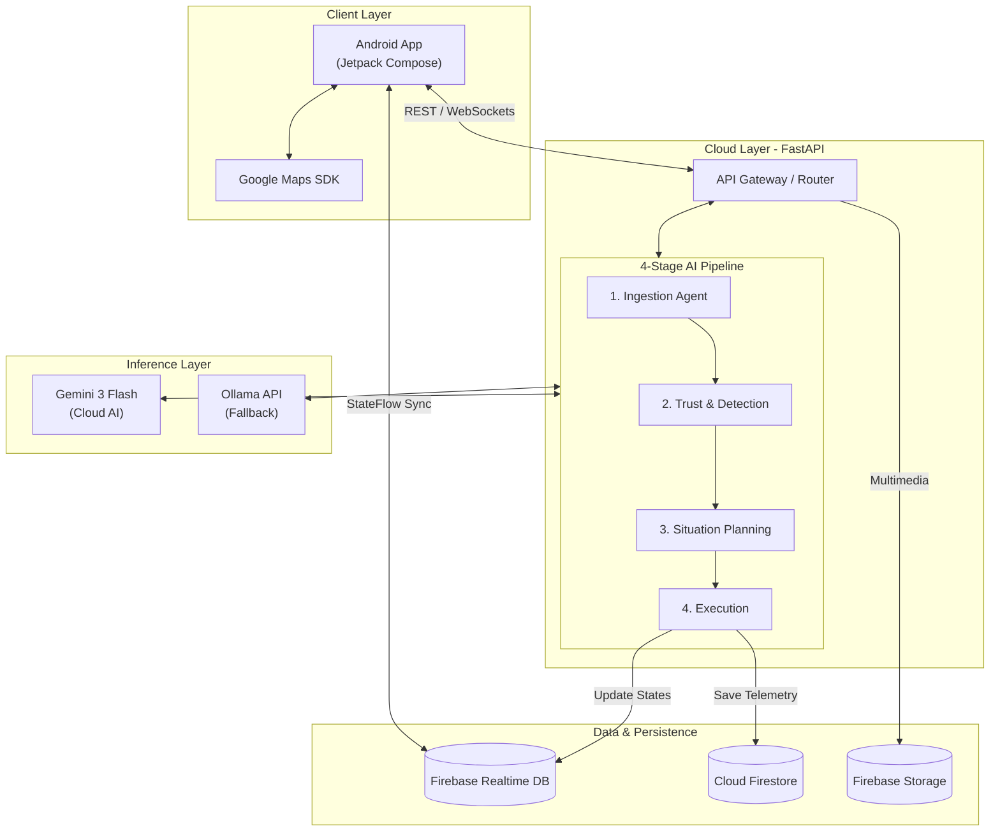

# TrafficGuard AI 🛡️
### Community-Powered Urban Crisis Intelligence & Smart Mobility Response

TrafficGuard AI is an advanced, AI-driven urban crisis intelligence platform designed for Pakistani cities to detect, analyze, simulate, and mitigate severe urban mobility disruptions like flash flooding, infrastructure failures, and major traffic blockages. Built using Google Antigravity and automated design-to-code pipelines for the Google Hackathon.

---

## 🌐 Distributed System Architecture & Connectivity

TrafficGuard AI is intentionally divided into three isolated, specialized environments to ensure modular scalability, rapid local prototyping, and highly responsive native rendering.

### System Diagram


### 1. Why the Ecosystem Modules Exist Separately
* **`android/` (Native Android Client):** Built as a native mobile client rather than a web application to leverage localized device capabilities, including fine-grained background location gathering (`Google Maps SDK`), multi-tap gesture detection, and hardware alerts.
* **`backend/` (FastAPI Cloud Engine):** Hosts the heavy 4-Stage AI Agent orchestration layer. Running this asynchronously in Python avoids blocking the mobile thread during heavy token evaluation and geospatial matrix filtering.
* **`Ollama API` (Fallback):** Integrated to execute offline language analysis, fallback processing heuristics, and cost-optimized parsing boundaries when primary server resources are unavailable.

### 2. How the Components Are Connected
* **Data Flow & REST Actions:** The Android client queries the FastAPI backend via structured JSON REST protocols across an established `pyngrok` tunnel or direct Google Cloud Run HTTP bindings.
* **Real-Time Data Streaming:** The backend streams immediate crisis states to the **Firebase Realtime Database**. The Android app subscribes to these streams via reactive Kotlin `StateFlow` connections, rendering active incident overlays instantly onto the user map.
* **AI Tooling Bridge (MCP):** Visual components created inside **Google Stitch** are pulled down into **Google Antigravity** using the **Stitch Model Context Protocol (MCP)**. This lets workspace agents scan design tokens and generate clean, native Material 3 Compose widgets directly.

---

## 🤖 4-Stage AI Pipeline & Model Orchestration

The application utilizes a multi-model approach, balancing cloud-based reasoning models with an external API fallback mechanism for deep inspection:
* **Cloud Infrastructure:** Powered by **Gemini 3 Flash** inside the Antigravity developer core for workspace logic execution.
* **Fallback Inference:** Utilizes **Ollama API** to handle text analysis patterns and structural validation metrics in case of primary model unavailability.

* 1. **Agent 1: Ingestion Agent:** Processes text inputs, executes multi-lingual parsing, and normalizes Urdu/Roman Urdu strings into target English categories.
2. **Agent 2: Trust & Detection Agent:** Cross-checks signals against external maps/weather telemetry and updates spatial cluster metrics to assign confidence metrics.
3. **Agent 3: Situation Planning Agent:** Gauges active incident impact boundaries and constructs three prioritized, human-readable crisis response tasks.
4. **Agent 4: Execution Agent:** Drives the predictive simulation engine, structures localized push alert formats, records operational telemetry, and fires Firestore tracking updates.

---

## 🛠️ Google Cloud & Third-Party Integration Stack

The architecture integrates deeply with Google's Cloud Console ecosystem to deliver location-aware features and fail-safe persistence:

### 🔌 Real APIs Implemented
* **Google Cloud Project Console:** Centralized hub managing environment authorization permissions, API usage quotas, and service roles.
* **Firebase Authentication:** Handles zero-friction, passwordless mobile access loops using Anonymous Auth sessions, keeping personal user information safe.
* **Firebase Realtime Database:** Handles hot real-time updates, syncing active traffic alerts directly to active drivers.
* **Google Cloud Firestore API:** Serves as the transactional persistence engine, tracking system settings, historical logs, and raw `AgentTrace` timelines.
* **Firebase Storage:** Houses multimedia incident uploads, binary assets, and raw telemetry trace exports.
* **Google Maps SDK (Android):** Renders the native dark-mode canvas on devices, including radius bounds and polyline routes.
* **Google Maps & Places API:** Resolves live coordinates, geo-hashes, and points-of-interest arrays to identify localized road blockages.
* **Gemini 3 Flash API:** Integrated into the FastAPI backend for advanced cloud-based reasoning and planning.

### 🧪 Mock APIs (Simulated for Hackathon)
* **Weather Telemetry API:** Mocked within the `Trust & Detection Agent` to simulate environmental factors (e.g., heavy rain or flooding) validating user reports.
* **City Traffic Congestion API:** Simulated data feeds showing congestion spikes (e.g., "340% increase") to demonstrate the `Situation Planning Agent's` dynamic rerouting and ETA calculation logic.

---

## 📁 Project Directory Map

```text
trafficguard-root/
├── android/                      # Native Mobile Application
│   └── app/src/main/java/com/trafficguard/app/
│       ├── MainActivity.kt       # Native bootloader window setup
│       ├── Navigation.kt         # Jetpack Navigation 3 graph & ViewModels
│       ├── data/                 # Repositories (Location, Report, Firebase Core)
│       └── ui/                   # Jetpack Compose Screens (Material 3 styling)
│           ├── home/             # Main dashboard featuring active Google Maps layouts
│           ├── drivingmode/      # High-visibility HUD layout with custom voice flags
│           ├── emergency/        # SOS incident dashboard & triple-tap triggers
│           └── report/           # Step-by-step reporting wizard with real-time AI states
├── backend/                      # Production API Environment
│   ├── main.py                   # FastAPI routing core & CORS middleware configurations
│   ├── pipeline/                 # 4-Agent pipeline framework engine
│   ├── Dockerfile                # Deployment container configuration targeting port 8080
│   └── .dockerignore             # Excluded local environment build logs
└── local_llm/                    # Fallback API Configuration Workspace
    └── ollama_config/            # Ollama prompt setups and service operational files
