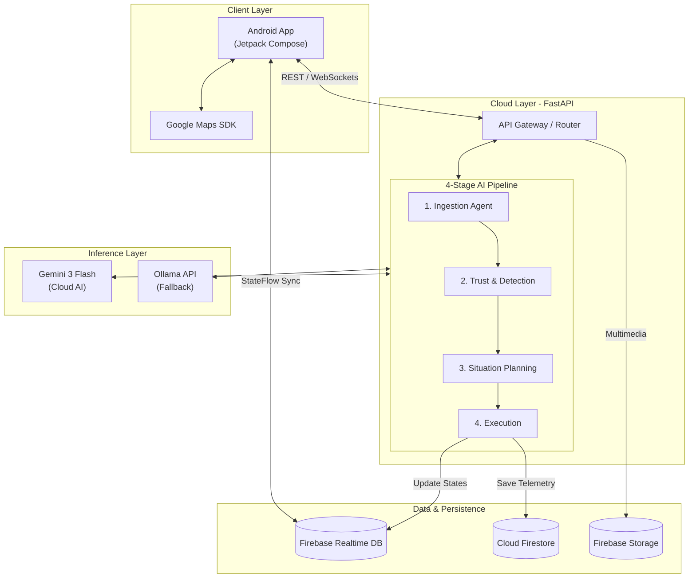

# TrafficGuard AI 🛡️
### Community-Powered Urban Crisis Intelligence & Smart Mobility Response

<p align="center">
  
  
  
  
  
  
  
  
  
  
</p>

---

TrafficGuard AI is an advanced, AI-driven urban crisis intelligence platform designed for Pakistani cities to detect, analyze, simulate, and mitigate severe urban mobility disruptions like flash flooding, infrastructure failures, and major traffic blockages. Built using Google Antigravity and automated design-to-code pipelines for the Google Hackathon.

---

## 🏆 Hackathon

This project was built for **AI Seekho**, a national AI hackathon organized by **Google Developer Groups (GDG) Pakistan**, aimed at empowering Pakistani developers to solve real-world problems using cutting-edge AI and Google technologies.

---

## 🌐 Distributed System Architecture & Connectivity

TrafficGuard AI is intentionally divided into three isolated, specialized environments to ensure modular scalability, rapid local prototyping, and highly responsive native rendering.

### System Diagram



### Why the Ecosystem Modules Exist Separately

**`android/` — Native Android Client**
Built as a native mobile client rather than a web application to leverage localized device capabilities, including fine-grained background location gathering (Google Maps SDK), multi-tap gesture detection, and hardware alerts.

**`backend/` — FastAPI Cloud Engine**
Hosts the heavy 4-Stage AI Agent orchestration layer. Running this asynchronously in Python avoids blocking the mobile thread during heavy token evaluation and geospatial matrix filtering.

**`Ollama API` — Fallback Inference**
Integrated to execute offline language analysis, fallback processing heuristics, and cost-optimized parsing boundaries when primary server resources are unavailable.

### How the Components Are Connected

**Data Flow & REST Actions:** The Android client queries the FastAPI backend via structured JSON REST protocols across an established `pyngrok` tunnel or direct Google Cloud Run HTTP bindings.

**Real-Time Data Streaming:** The backend streams immediate crisis states to the Firebase Realtime Database. The Android app subscribes to these streams via reactive Kotlin `StateFlow` connections, rendering active incident overlays instantly onto the user map.

**AI Tooling Bridge (MCP):** Visual components created inside **Google Stitch** are pulled down into **Google Antigravity** using the **Stitch Model Context Protocol (MCP)**. This lets workspace agents scan design tokens and generate clean, native Material 3 Compose widgets directly.

---

## 🤖 4-Stage AI Pipeline & Model Orchestration

The application utilizes a multi-model approach, balancing cloud-based reasoning with a fallback inference mechanism:

**Cloud Infrastructure:** Powered by **Gemini 3 Flash** inside the Antigravity developer core for workspace logic execution.

**Fallback Inference:** Utilizes **Ollama API** to handle text analysis patterns and structural validation metrics in case of primary model unavailability.

| Stage | Agent | Responsibility |
|-------|-------|----------------|
| 1 | **Ingestion Agent** | Processes text inputs, executes multi-lingual parsing, and normalizes Urdu/Roman Urdu strings into target English categories |
| 2 | **Trust & Detection Agent** | Cross-checks signals against external maps/weather telemetry and updates spatial cluster metrics to assign confidence scores |
| 3 | **Situation Planning Agent** | Gauges active incident impact boundaries and constructs three prioritized, human-readable crisis response tasks |
| 4 | **Execution Agent** | Drives the predictive simulation engine, structures localized push alert formats, records operational telemetry, and fires Firestore tracking updates |

---

## 🛠️ Google Cloud & Third-Party Integration Stack

The architecture integrates deeply with Google's Cloud Console ecosystem to deliver location-aware features and fail-safe persistence.

### 🔌 Real APIs Implemented

| Service | Purpose |
|---------|---------|
| **Google Cloud Project Console** | Centralized hub managing environment authorization, API usage quotas, and service roles |
| **Firebase Authentication** | Passwordless mobile access using Anonymous Auth sessions |
| **Firebase Realtime Database** | Hot real-time updates syncing active traffic alerts directly to drivers |
| **Google Cloud Firestore** | Transactional persistence for system settings, historical logs, and `AgentTrace` timelines |
| **Firebase Storage** | Multimedia incident uploads, binary assets, and telemetry trace exports |
| **Google Maps SDK (Android)** | Native dark-mode map canvas with radius bounds and polyline routes |
| **Google Maps & Places API** | Live coordinate resolution, geo-hashes, and POI arrays for road blockage identification |
| **Gemini 3 Flash API** | Advanced cloud-based reasoning and planning inside the FastAPI backend |

### 🧪 Mock APIs (Simulated for Hackathon)

| Service | Simulated Behavior |
|---------|-------------------|
| **Weather Telemetry API** | Mocked within the Trust & Detection Agent to simulate environmental factors (e.g., heavy rain, flooding) validating user reports |
| **City Traffic Congestion API** | Simulated data feeds showing congestion spikes (e.g., "340% increase") to demonstrate the Situation Planning Agent's dynamic rerouting and ETA calculation logic |

---

## 📁 Project Directory Map

```text
trafficguard-root/
├── android/                      # Native Mobile Application
│   └── app/src/main/java/com/trafficguard/app/
│       ├── MainActivity.kt       # Native bootloader window setup
│       ├── Navigation.kt         # Jetpack Navigation 3 graph & ViewModels
│       ├── data/                 # Repositories (Location, Report, Firebase Core)
│       └── ui/                   # Jetpack Compose Screens (Material 3 styling)
│           ├── home/             # Main dashboard featuring active Google Maps layouts
│           ├── drivingmode/      # High-visibility HUD layout with custom voice flags
│           ├── emergency/        # SOS incident dashboard & triple-tap triggers
│           └── report/           # Step-by-step reporting wizard with real-time AI states
├── backend/                      # Production API Environment
│   ├── main.py                   # FastAPI routing core & CORS middleware configurations
│   ├── agents/                   # 4-Stage AI Agent definitions
│   ├── services/                 # Firebase and external API integration services
│   ├── models/                   # Pydantic schemas for data validation
│   └── Dockerfile                # Deployment container configuration
└── frontend/                     # Web Dashboard Application
    ├── src/                      # React application source code
    ├── index.html                # Main HTML entrypoint
    └── vite.config.ts            # Vite bundler configuration
```

---

## 📄 License

```
MIT License

Copyright (c) 2025 TrafficGuard AI

Permission is hereby granted, free of charge, to any person obtaining a copy
of this software and associated documentation files (the "Software"), to deal
in the Software without restriction, including without limitation the rights
to use, copy, modify, merge, publish, distribute, sublicense, and/or sell
copies of the Software, and to permit persons to whom the Software is
furnished to do so, subject to the following conditions:

The above copyright notice and this permission notice shall be included in all
copies or substantial portions of the Software.

THE SOFTWARE IS PROVIDED "AS IS", WITHOUT WARRANTY OF ANY KIND, EXPRESS OR
IMPLIED, INCLUDING BUT NOT LIMITED TO THE WARRANTIES OF MERCHANTABILITY,
FITNESS FOR A PARTICULAR PURPOSE AND NONINFRINGEMENT. IN NO EVENT SHALL THE
AUTHORS OR COPYRIGHT HOLDERS BE LIABLE FOR ANY CLAIM, DAMAGES OR OTHER
LIABILITY, WHETHER IN AN ACTION OF CONTRACT, TORT OR OTHERWISE, ARISING FROM,
OUT OF OR IN CONNECTION WITH THE SOFTWARE OR THE USE OR OTHER DEALINGS IN THE
SOFTWARE.
```

---

<p align="center">Made with ❤️ in Pakistan &nbsp;|&nbsp; Built for <strong>AI Seekho Hackathon</strong> by <strong>GDG Pakistan</strong></p>
